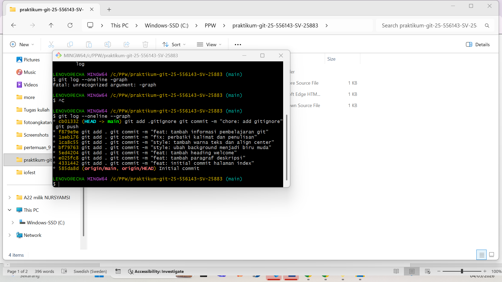
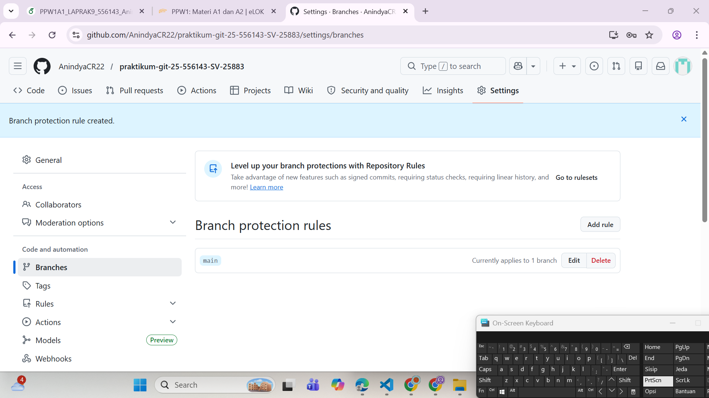

# praktikum-git-25-556143-SV-25883

# 💻 Praktikum Git & GitHub

## 👤 Identitas
- Nama: Anindya Ceshya Ramadhani
- NIM: 25/556143/SV/25883

---

## 📌 Deskripsi Project
Project ini merupakan tugas praktikum Git & GitHub.  
Berisi website sederhana menggunakan HTML yang dikembangkan secara bertahap menggunakan version control.

---

## 🚀 Fitur Website
- Halaman HTML sederhana
- Tampilan dengan background warna
- Penambahan heading dan paragraf
- Perbaikan penulisan (typo)

---

## 🛠️ Tools yang Digunakan
- Git (Version Control)
- GitHub (Repository Hosting)
- Visual Studio Code (Code Editor)

---

## 📸 Screenshot Git Log
Berikut adalah riwayat commit project:



---

## 🔁 Riwayat Perkembangan (Commit)
- feat: initial commit halaman index
- feat: tambah paragraf deskripsi
- feat: tambah heading welcome
- style: ubah background menjadi biru muda
- style: tambah warna teks dan align center
- fix: perbaiki kalimat dan penulisan
- feat: tambah informasi pembelajaran git

---

## ▶️ Cara Menjalankan
1. Clone repository:
   ```bash
   git clone https://github.com/username/praktikum-git-NIM.git

## 🔒 Branch Protection
Berikut pengaturan branch protection pada branch main:

